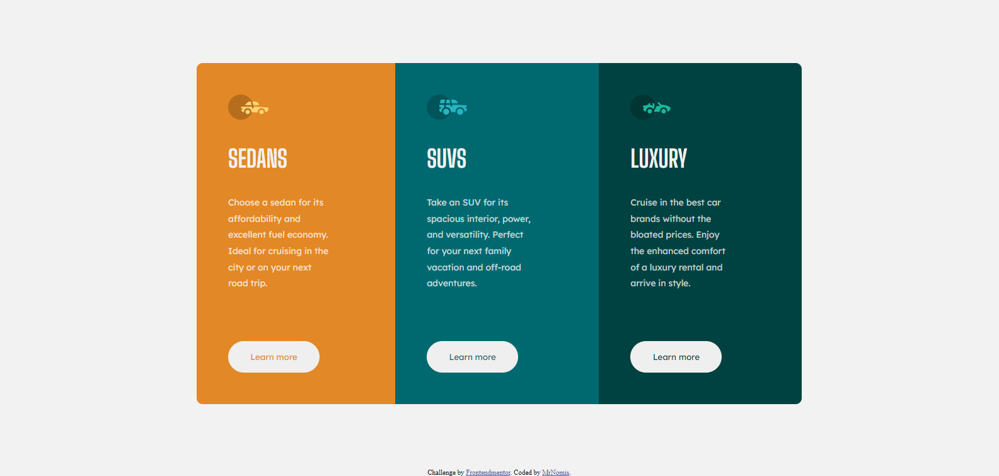

# Frontend Mentor - 3-column preview card component solution

This is a solution to the [3-column preview card component challenge on Frontend Mentor](https://www.frontendmentor.io/challenges/3column-preview-card-component-pH92eAR2-). Frontend Mentor challenges help you improve your coding skills by building realistic projects. 

## Table of contents

- [Overview](#overview)
  - [The challenge](#the-challenge)
  - [Screenshot](#screenshot)
  - [Links](#links)
  - [Built with](#built-with)
  - [What I learned](#what-i-learned)
- [Author](#author)

## Overview
Hey there. 
So this is my attempt on this Frontend-mentor challenge.
I would say any of my three versions are not that bad if the screen is draged to full size.

However inbetween my breaking points if i drag the window strange things things happen to my
tamplate. It´s just not moving correctly. I would apreciated if someone could tell me what i did
wrong with my breakpoints or if my browser is just the problem.

### The challenge

Users should be able to:

- View the optimal layout depending on their device's screen size
- See hover states for interactive elements

### Screenshot

### Links

- Solution URL: [Add solution URL here](https://your-solution-url.com)

### Built with

- Semantic HTML5 markup
- CSS custom properties
- Flexbox
- Mobile-first workflow

### What I learned

This was my fist try using @media breakpoint without using bootstrap so i not quit sure what went wrong
but it´s not working like i want it =)

## Author

- Frontend Mentor - [@yourusername](https://www.frontendmentor.io/profile/MrNomis)

